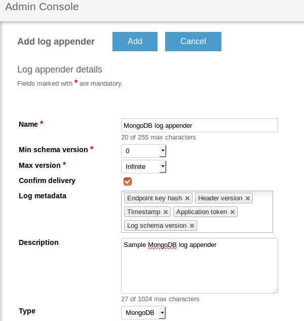
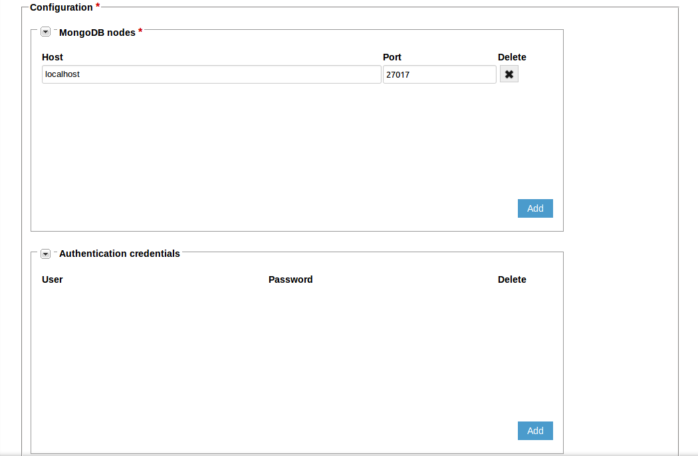
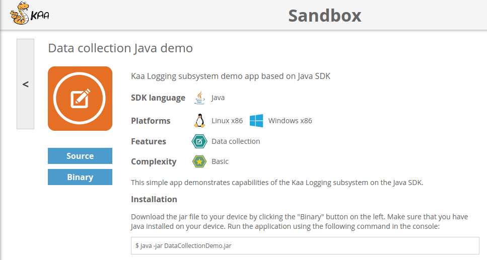
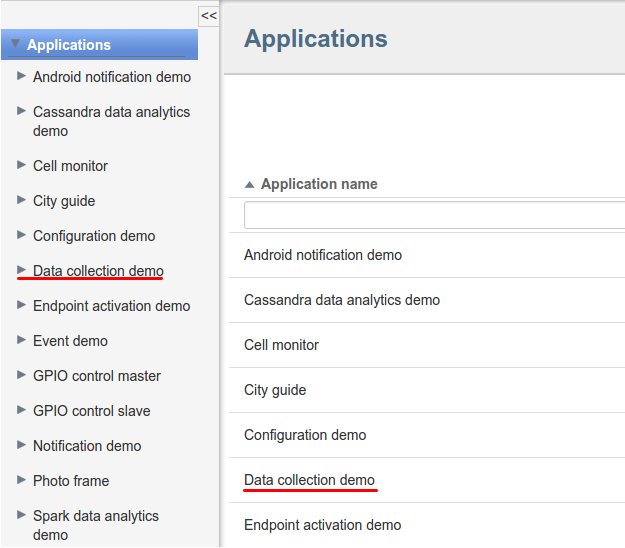
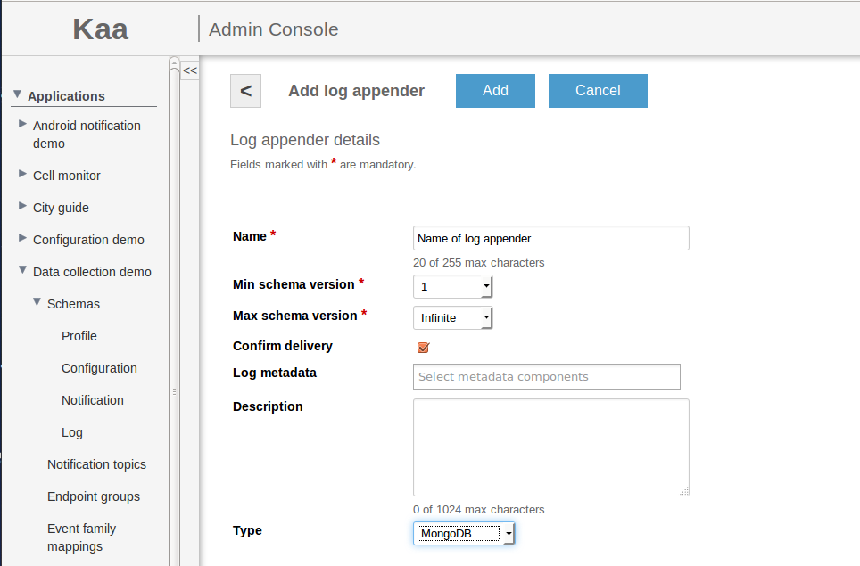
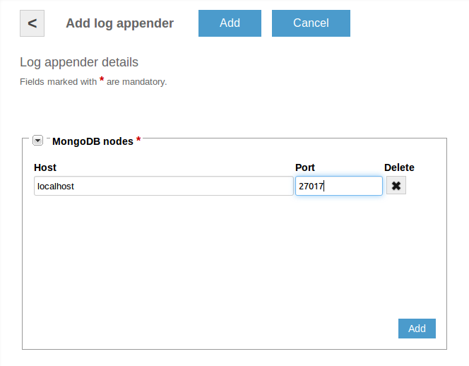
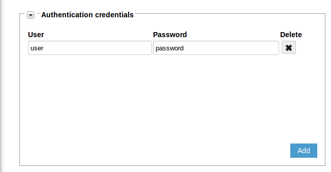
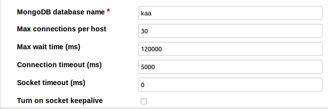



* TOC
{:toc}

The MongoDB log appender is responsible for transferring logs from the Operations service to the MongoDB database. The logs are stored in the table named
_logs\_$[applicationToken]({{root_url}}Glossary)_, where _$[applicationToken]({{root_url}}Glossary)_ matches the token of the current application.

# Creating MongoDB log appender in Admin UI

The easiest way to create a MongoDB log appender for your application is by using Admin UI.

To create a log appender of the MongoDB storage type, do the following:

1. In the **Log appenders** window, click **Add log appender**.
2. Enter the log appender name and description, select the minimum and maximum supported log schema version, and select necessary log metadata fields.
3. Set the log appender type to _MongoDB_.

4. Fill in the MongoDB log appender [configuration](#configuration) form.
5. Click **Add** button. Log appender is ready and operational at this point.



# Creating MongoDB log appender with Admin REST API

It is also possible to create a MongoDB log appender for your application by using
[Admin REST API]({{root_url}}Programming-guide/Server-REST-APIs/#!/Logging/editLogAppender).
The following example illustrates how to create the MongoDB log appender via Admin Rest API.

## Configuration

The MongoDB log appender configuration must match to
 [this](https://github.com/kaaproject/kaa/blob/master/server/appenders/mongo-appender/src/main/avro/mongodb-appender-config.avsc) Avro schema.

Fields of avro schema:

* MongoDB nodes - list of MongoDB hosts.
* Authentication credentials - credentials used to authenticate on MongoDB cluster.
* Other fields which configure of connection to MongoDB.

|name                   |description                                                            |
|-----------------------|-----------------------------------------------------------------------|
|dbName                 |Name of the database                                                   |
|connectionsPerHost     |Max number of connections per host                                     |
|maxWaitTime            |Max wait time for connection in milliseconds                           |
|connectionTimeout      |Connection timeout in milliseconds                                     |
|socketTimeout          |Socket timeout in milliseconds                                         |
|socketKeepalive        |Turn on socket keep alive (boolean value)                              |
|includeClientProfile   |Whether to include client-side endpoint profile data (boolean value)   |
|includeServerProfile   |Whether to include server-side endpoint profile data (boolean value)   |

An example configuration that matches to previously introduced Avro schema is as below:

```json
{
    "mongoServers":[
        {
            "host":"127.0.0.1",
            "port":27017
        }
    ],
    "mongoCredentials":[
        {
            "user":"user",
            "password":"password"
        }
    ],
    "dbName":"kaa",
    "connectionsPerHost":{
        "int":30
    },
    "maxWaitTime":{
        "int":120000
    },
    "connectionTimeout":{
        "int":5000
    },
    "socketTimeout":{
        "int":0
    },
    "socketKeepalive":{
        "boolean":false
    },
    "includeClientProfile":{
        "boolean":false
    },
    "includeServerProfile":{
        "boolean":false
    }
}
```

## Administration

The following Admin REST API call example illustrates how to create a new MongoDB log appender.

```bash
curl -v -S -u devuser:devuser123 -X POST -H 'Content-Type: application/json' -d @mongoDBLogAppender.json "http://localhost:8080/kaaAdmin/rest/api/logAppender" | python -mjson.tool
```

where file ```mongoDBLogAppender.json``` contains the following data:

```
{
    "pluginClassName":"org.kaaproject.kaa.server.appenders.mongo.appender.MongoDbLogAppender",
    "pluginTypeName":"MongoDB",
    "applicationId":"5",
    "applicationToken":"82635305199158071549",
    "name":"Sample MongoDB log appender",
    "description":"Sample MngoDB log appender",
    "headerStructure":[
        "KEYHASH",
        "VERSION",
        "TIMESTAMP",
        "TOKEN",
        "LSVERSION"
    ],
    "maxLogSchemaVersion":2147483647,
    "minLogSchemaVersion":1,
    "tenantId":"1",
    "jsonConfiguration":"{\"mongoServers\":[{\"host\":\"localhost\",\"port\":27017}],\"mongoCredentials\":[],\"dbName\":\"kaa\",\"connectionsPerHost\":{\"int\":30},\"maxWaitTime\":{\"int\":120000},\"connectionTimeout\":{\"int\":5000},\"socketTimeout\":{\"int\":0},\"socketKeepalive\":{\"boolean\":false},\"includeClientProfile\":{\"boolean\":false},\"includeServerProfile\":{\"boolean\":false}}"
}
```

Example result:

```json
{
    "applicationId":"5",
    "applicationToken":"82635305199158071549",
    "confirmDelivery":true,
    "createdTime":1466504475844,
    "createdUsername":"devuser",
    "description":"Sample MongoDB log appender",
    "headerStructure":[
        "KEYHASH",
        "VERSION",
        "TIMESTAMP",
        "TOKEN",
        "LSVERSION"
    ],
    "id":"163840",
    "jsonConfiguration":"{\"mongoServers\":[{\"host\":\"localhost\",\"port\":27017}],\"mongoCredentials\":[],\"dbName\":\"kaa\",\"connectionsPerHost\":{\"int\":30},\"maxWaitTime\":{\"int\":120000},\"connectionTimeout\":{\"int\":5000},\"socketTimeout\":{\"int\":0},\"socketKeepalive\":{\"boolean\":false},\"includeClientProfile\":{\"boolean\":false},\"includeServerProfile\":{\"boolean\":false}}",
    "maxLogSchemaVersion":2147483647,
    "minLogSchemaVersion":1,
    "name":"Sample MngoDB log appender",
    "pluginClassName":"org.kaaproject.kaa.server.appenders.mongo.appender.MongoDbLogAppender",
    "pluginTypeName":"MongoDB",
    "tenantId":"1"
}
```

# Playing with MongoDB log appender

We'll use [Data collection demo](https://github.com/kaaproject/sample-apps/tree/master/datacollectiondemo/source) from Kaa Sandbox. Our example will send data
to Kaa and then persist it to MongoDB. Also, we'll do selection queries on persisted data.

We have next log schema:

```json
{
    "type":"record",
    "name":"LogData",
    "namespace":"org.kaaproject.kaa.schema.sample.logging",
    "fields":[
        {
            "name":"level",
            "type":{
                "type":"enum",
                "name":"Level",
                "symbols":[
                    "KAA_DEBUG",
                    "KAA_ERROR",
                    "KAA_FATAL",
                    "KAA_INFO",
                    "KAA_TRACE",
                    "KAA_WARN"
                ]
            }
        },
        {
            "name":"tag",
            "type":"string"
        },
        {
            "name":"message",
            "type":"string"
        },
        {
            "name":"timeStamp",
            "type":"long"
        }
    ]
}
```

Display string

```json
"schema": "{\n  \"type\":\"record\",\n  \"name\":\"LogData\",\n  \"namespace\":\"org.kaaproject.kaa.schema.sample.logging\",\n  \"fields\":[\n Field (4 rows) \n]\n}"
```

The following JSON example matches the previous schema.

```json
{
    "level":"KAA_INFO",
    "tag":"TEST_TAG",
    "message":"My simple message",
    "timeStamp":"1466075369795"
}

```

1. Go to Data collection demos in Sandbox.

2. In the Admin UI follow to **Data collection demo** application.


3. There can be one MongoDB log appender. You can add new with your parameters.
4. Enter name of the new appender.
5. Select **MongoDB** appender type.

6. Add new node in the **Configuration** section (localhost:27017).

7. Also you can add some **Authentication credentials**.

8. And other important parameters of configuration. You can change them or use default.

9. Click **Add** button on the top of the screen to create and deploy appender.

10. Verify that newly created appender has appeared in list.

11. Now use instructions from Sandbox to run Data collection demo application and verify that logs have been successfully sent to Kaa.
12. After this you should see something like below:

    ```
    2016-06-21 12:38:12,260 [main] INFO  o.k.k.d.d.DataCollectionDemo - Data collection demo started
    2016-06-21 12:38:13,337 [pool-2-thread-1] INFO  o.k.k.d.d.DataCollectionDemo - Kaa client started
    2016-06-21 12:38:13,339 [main] INFO  o.k.k.d.d.DataCollectionDemo - Log record {"level": "KAA_INFO", "tag": "TAG", "message": "MESSAGE_0", "timeStamp": 1466501893337} sent
    2016-06-21 12:38:13,340 [main] INFO  o.k.k.d.d.DataCollectionDemo - Log record {"level": "KAA_INFO", "tag": "TAG", "message": "MESSAGE_1", "timeStamp": 1466501893337} sent
    2016-06-21 12:38:13,340 [main] INFO  o.k.k.d.d.DataCollectionDemo - Log record {"level": "KAA_INFO", "tag": "TAG", "message": "MESSAGE_2", "timeStamp": 1466501893337} sent
    2016-06-21 12:38:13,340 [main] INFO  o.k.k.d.d.DataCollectionDemo - Log record {"level": "KAA_INFO", "tag": "TAG", "message": "MESSAGE_3", "timeStamp": 1466501893337} sent
    2016-06-21 12:38:13,340 [main] INFO  o.k.k.d.d.DataCollectionDemo - Log record {"level": "KAA_INFO", "tag": "TAG", "message": "MESSAGE_4", "timeStamp": 1466501893337} sent
    2016-06-21 12:38:13,627 [main] INFO  o.k.k.d.d.DataCollectionDemo - Received log record delivery info. Bucket Id [0]. Record delivery time [290 ms].
    2016-06-21 12:38:13,627 [main] INFO  o.k.k.d.d.DataCollectionDemo - Received log record delivery info. Bucket Id [0]. Record delivery time [290 ms].
    2016-06-21 12:38:13,627 [main] INFO  o.k.k.d.d.DataCollectionDemo - Received log record delivery info. Bucket Id [0]. Record delivery time [290 ms].
    2016-06-21 12:38:13,627 [main] INFO  o.k.k.d.d.DataCollectionDemo - Received log record delivery info. Bucket Id [0]. Record delivery time [290 ms].
    2016-06-21 12:38:13,627 [main] INFO  o.k.k.d.d.DataCollectionDemo - Received log record delivery info. Bucket Id [0]. Record delivery time [290 ms].
    2016-06-21 12:38:13,628 [pool-2-thread-1] INFO  o.k.k.d.d.DataCollectionDemo - Kaa client stopped
    2016-06-21 12:38:13,629 [main] INFO  o.k.k.d.d.DataCollectionDemo - Data collection demo stopped
    ```

13. Let's verify that our logs have been persisted in MongoDB. Go to Sandbox VM and run next command to connect MongoDB:

    ```bash
    mongo kaa
    db.logs_$your_application_token$.find()
    ```

14. You should observe similar output:

    ```bash
    { "_id" : ObjectId("57690b05d55fb20804a7f40e"), "header" : { "endpointKeyHash" : { "string" : "UtzjR4tTem5XDJRZRX9ftZfR7ng=" }, "applicationToken" : { "string" : "82635305199158071549" }, "headerVersion" : { "int" : 1 }, "timestamp" : { "long" : NumberLong("1466501893596") }, "logSchemaVersion" : null }, "event" : { "level" : "KAA_INFO", "tag" : "TAG", "message" : "MESSAGE_0", "timeStamp" : NumberLong("1466501893337") } }
    { "_id" : ObjectId("57690b05d55fb20804a7f40f"), "header" : { "endpointKeyHash" : { "string" : "UtzjR4tTem5XDJRZRX9ftZfR7ng=" }, "applicationToken" : { "string" : "82635305199158071549" }, "headerVersion" : { "int" : 1 }, "timestamp" : { "long" : NumberLong("1466501893596") }, "logSchemaVersion" : null }, "event" : { "level" : "KAA_INFO", "tag" : "TAG", "message" : "MESSAGE_1", "timeStamp" : NumberLong("1466501893337") } }
    { "_id" : ObjectId("57690b05d55fb20804a7f410"), "header" : { "endpointKeyHash" : { "string" : "UtzjR4tTem5XDJRZRX9ftZfR7ng=" }, "applicationToken" : { "string" : "82635305199158071549" }, "headerVersion" : { "int" : 1 }, "timestamp" : { "long" : NumberLong("1466501893596") }, "logSchemaVersion" : null }, "event" : { "level" : "KAA_INFO", "tag" : "TAG", "message" : "MESSAGE_2", "timeStamp" : NumberLong("1466501893337") } }
    { "_id" : ObjectId("57690b05d55fb20804a7f411"), "header" : { "endpointKeyHash" : { "string" : "UtzjR4tTem5XDJRZRX9ftZfR7ng=" }, "applicationToken" : { "string" : "82635305199158071549" }, "headerVersion" : { "int" : 1 }, "timestamp" : { "long" : NumberLong("1466501893596") }, "logSchemaVersion" : null }, "event" : { "level" : "KAA_INFO", "tag" : "TAG", "message" : "MESSAGE_3", "timeStamp" : NumberLong("1466501893337") } }
    { "_id" : ObjectId("57690b05d55fb20804a7f412"), "header" : { "endpointKeyHash" : { "string" : "UtzjR4tTem5XDJRZRX9ftZfR7ng=" }, "applicationToken" : { "string" : "82635305199158071549" }, "headerVersion" : { "int" : 1 }, "timestamp" : { "long" : NumberLong("1466501893596") }, "logSchemaVersion" : null }, "event" : { "level" : "KAA_INFO", "tag" : "TAG", "message" : "MESSAGE_4", "timeStamp" : NumberLong("1466501893337") } }
    ```

If your output doesn't match above one, please follow our [troubleshooting guide]({{root_url}}Administration-guide/Troubleshooting).
